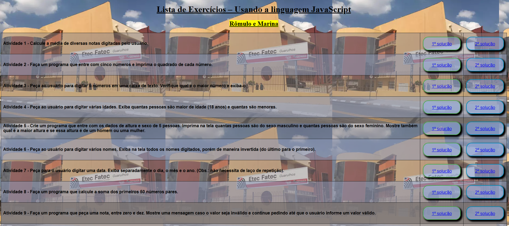
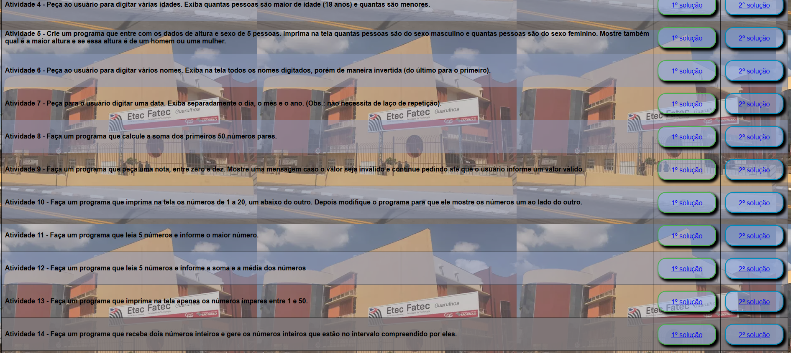
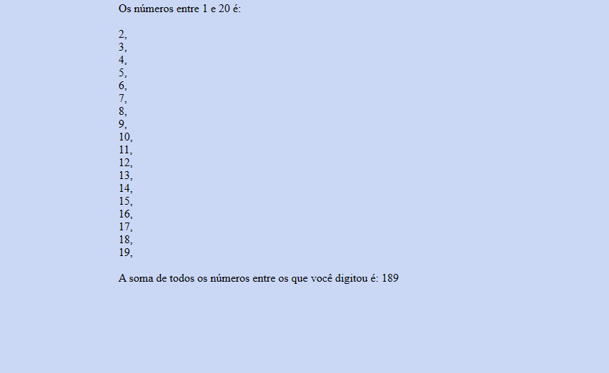

# jsListaExercicios
atividade para treinar lógica com javascript. feito em dupla. todas as primeiras soluções dos exercícios foram escritas por mim e as segundas foram escritas pela minha dupla
  

  <h3>Menu das atividades e suas respostas</h3>
  

  

  

  

  <h3>Uma das páginas de resposta</h3>
  

  
